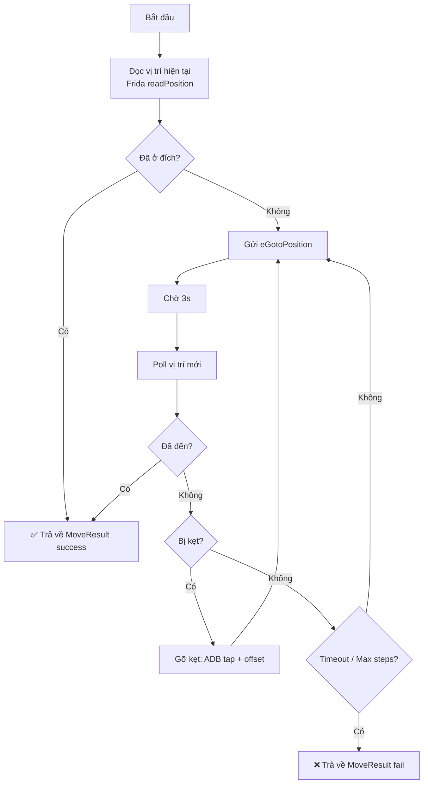

# Di Chuyển Nhân Vật — Knowhow

## Tổng quan

Có **3 phương thức** di chuyển nhân vật:

| Phương thức | Cách hoạt động | Ưu điểm | Nhược điểm |
|---|---|---|---|
| **eGotoPosition** | Gửi packet opcode 248 qua socket | Chính xác, nhanh | Bị block nếu có vật cản |
| **GotoFindingPath** | Gọi hàm IL2CPP native | Client tự tìm đường, né vật cản | Cần PlayerMain instance |
| **ADB Tap** | Tap màn hình giả lập | Luôn hoạt động | Không chính xác, chậm |

## Kiến trúc Module

```
core/movement.py
├── MovementController     # Controller chính
│   ├── read_position()    # Đọc vị trí từ Frida hooks (realtime)
│   ├── move_to_game()     # Di chuyển bằng tọa độ 3 số
│   ├── move_to_world()    # Di chuyển bằng tọa độ 5 số
│   ├── move_to_native()   # Di chuyển bằng IL2CPP native
│   └── _unstuck()         # Gỡ kẹt tự động
├── MoveResult             # Kết quả di chuyển
└── Utilities              # calculate_distance, estimate_travel_time
```

## Flow Di Chuyển (Feedback Loop)



## Cải tiến so với code cũ

### Trước (test_move_final.py)
- Dùng **tcpdump** để capture packets → parse opcode 9 → tìm vị trí
- Mỗi lần detect tốn **5-8 giây** (start tcpdump + capture + kill + pull + parse)
- Entity detection dễ nhầm (chọn entity di chuyển nhiều nhất ≠ mình)

### Sau (core/movement.py)
- Dùng **Frida recv hook** (`readPosition()`) → vị trí realtime
- Mỗi lần poll chỉ **0.5 giây**
- Entity tracking chính xác (Frida đã parse sẵn opcode 9)

## Bug đã fix

> [!WARNING]
> `game_bot.py` `move_to()` gửi sai field name:
> ```diff
> - return self.send_gs('eGotoPosition', targetPositionX=x, targetPositionY=y)
> + return self.send_gs('eGotoPosition', mapx=x, mapy=y)
> ```
> `targetPositionX/Y` là field của `CastSkill`, không phải `GotoPosition`.
> Protobuf silently ignores unknown fields → packet gửi đi rỗng → nhân vật không di chuyển!

## Sử dụng

### Cơ bản
```python
from features.bot.game_bot import VLTK1Bot
from core.movement import MovementController

bot = VLTK1Bot()
bot.connect()

mover = MovementController(bot)

# Di chuyển đến tọa độ 3 số (minimap)
result = mover.move_to_game(240, 175)
print(result)  # MoveResult(success=True, ...)

# Di chuyển đến tọa độ 5 số (world)
result = mover.move_to_world(54272, 50048)
```

### Với callback
```python
def on_step(step, gx, gy, dist):
    print(f"Step {step}: ({gx}, {gy}) dist={dist:.0f}")

result = mover.move_to_game(210, 195, on_step=on_step)
```

### Native pathfinding
```python
from core.position import game_to_world_center
wx, wy = game_to_world_center(240, 175)
result = mover.move_to_native(wx, wy)
```

### Tùy chỉnh config
```python
mover = MovementController(bot, config={
    "max_steps": 50,
    "arrival_threshold_world": 300,  # Ngưỡng đến nơi (world units)
    "stuck_threshold": 5,            # Số lần liên tiếp stuck
    "wait_after_move": 2.0,          # Giây chờ sau mỗi move
    "timeout": 180,                  # Timeout tổng
})
```

## Test

```bash
# Di chuyển gần (+3, -2 ô) rồi quay về
python tests/test_movement.py

# Di chuyển đến tọa độ cụ thể
python tests/test_movement.py --target 240,175

# Di chuyển đến Dã Tẩu
python tests/test_movement.py --target da_tau

# Dùng native pathfinding
python tests/test_movement.py --target da_tau --method native

# Tăng số bước tối đa
python tests/test_movement.py --target 240,175 --steps 50
```

## Phát hiện (Ngày 28/04/2026)

- Bug `move_to()` gửi sai field name → fix thành `mapx`, `mapy`
- Frida hooks đã có `readPosition()` realtime → không cần tcpdump
- Tạo `MovementController` với feedback loop thay thế toàn bộ test scripts cũ
- Thêm `move_to_game()` trong `game_bot.py` cho tiện sử dụng
