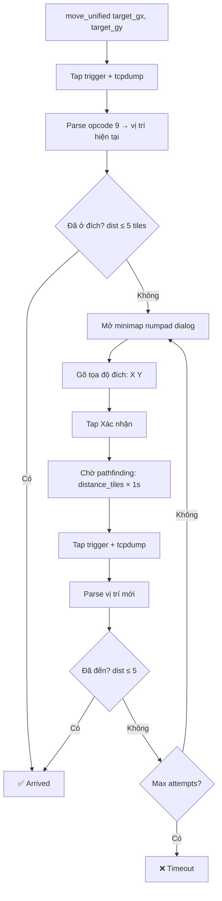

# Di Chuyển Nhân Vật — Knowhow

## Tổng quan

Hệ thống di chuyển sử dụng **Numpad Navigation** — nhập tọa độ vào dialog minimap qua ADB, kết hợp tcpdump để xác minh vị trí.

> [!IMPORTANT]
> Không dùng OCR. Không gửi packet trực tiếp (server-side pathfinding + SSL encryption).
> Movement 100% qua ADB tap + passive tcpdump.

## Kiến trúc

| Thành phần | Vai trò |
|---|---|
| **ADB tap** | Mở numpad dialog, nhập tọa độ, xác nhận |
| **tcpdump** | Bắt gói tin opcode 9 để đọc vị trí hiện tại |
| **Tap trigger** | Tap nhẹ screen → server phản hồi opcode 9 → biết vị trí |

```
core/movement.py
├── MovementController
│   ├── move_unified()          # Entry point chính
│   ├── move_via_minimap()      # Numpad navigation loop
│   ├── _send_numpad_goto()     # Mở dialog + gõ tọa độ + xác nhận
│   ├── _numpad_type_coords()   # Gõ từng số trên numpad
│   ├── _get_position_tcpdump() # Tap trigger + tcpdump → vị trí
│   └── _find_entity_position() # Parse opcode 9 → entity gần nhất
```

## Flow Di Chuyển



## Numpad Layout

```
┌─────────────────────────┐
│   (500,186) 7  8  9     │
│   (500,241) 4  5  6     │
│   (500,296) 1  2  3     │
│   (500,351) x  0  space │
│                         │
│   [Xác nhận] (265,333)  │
└─────────────────────────┘

Cột: 500 / 570 / 630
Dòng: 186 / 241 / 296 / 351

Minimap button: (890, 120)
Close keyboard: (700, 335)
```

## Tọa độ quan trọng

| Nút | Vị trí ADB |
|---|---|
| Mở minimap dialog | `(890, 120)` |
| Đóng giao diện trước | `(700, 335)` |
| Xác nhận | `(265, 333)` |
| Tap trigger (center screen) | `(480, 300)` |

## Position Detection

Sử dụng **tcpdump + tap trigger** thay vì Frida hooks (ổn định hơn trên nhiều instance):

```python
# 1. Start tcpdump trên device
tcpdump -i any -U -w /tmp/pos.pcap port {game_port}

# 2. ADB tap center screen → server phản hồi opcode 9
adb shell input tap 480 300

# 3. Pull pcap + parse opcode 9 → world coords
# 4. Convert world → game: game_x = world_x // 256
```

> [!NOTE]
> **Game port** được detect tự động qua `netstat -tnp | grep jx1mobile`

### Hạn chế entity detection

Ở khu vực đông người, opcode 9 chứa nhiều entity. Hệ thống ưu tiên:
1. Entity có tọa độ gần `last_known_pos` nhất
2. Entity có `world_x > 10000` (lọc entity giả)
3. Nếu không có reference → dùng entity cuối cùng parse được

## Sử dụng

### CLI Test
```bash
# Di chuyển đến tọa độ
python tests/test_movement.py --target 220,190

# Debug mode
python tests/test_movement.py --target 220,190 --debug
```

### Trong code
```python
from features.bot.game_bot import VLTK1Bot
from core.movement import MovementController

bot = VLTK1Bot()
bot.connect()

mover = MovementController(bot)
result = mover.move_unified(220, 190)

if result.success:
    print(f"Arrived at ({result.end_x}, {result.end_y})")
```

## Kết quả test thực tế

```
Move to (220, 190)
Start:    (213, 200)
End:      (219, 192)
Target:   (220, 190)
Distance: 2.4 tiles
Steps:    1
Time:     27.1s
>>> OK
```

## Hạn chế hiện tại

| Vấn đề | Chi tiết |
|---|---|
| **Khu đông** | Position detect ±5 tiles do nhiễu entity |
| **Pathfind fail** | Game reject nếu tọa độ đích unreachable ("Không tìm được đường") |
| **Thời gian** | Mỗi attempt ~15-30s (chờ pathfinding + tcpdump) |
| **Cross-map** | Chưa hỗ trợ di chuyển giữa các map |

## Lịch sử phát triển

| Ngày | Thay đổi |
|---|---|
| 28/04 | Ban đầu: eGotoPosition opcode 248 + Frida hooks |
| 29/04 | Chuyển sang numpad navigation + tcpdump (ổn định hơn) |
| 29/04 | Fix confirm button `(265, 333)`, fix entity detection |
| 29/04 | Thêm proximity-based entity selection |
| 30/04 | Test thành công: `(213,200) → (219,192)` target `(220,190)` ✅ |
