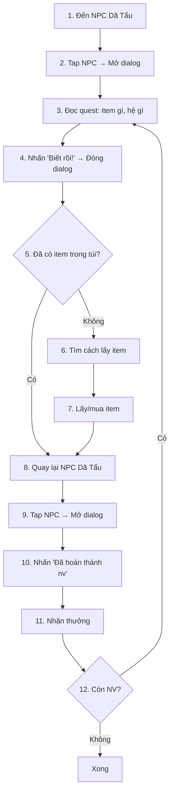

# Dã Tẩu Bot — Roadmap hoàn thiện

## Flow hoàn chỉnh của 1 vòng Dã Tẩu

## Trạng thái hiện tại

| # | Bước | Trạng thái | Module |
|---|------|-----------|--------|
| 1 | Di chuyển đến NPC | ✅ Done | `core/movement.py` |
| 2 | Tap NPC mở dialog | ✅ Done | ADB tap `(430, 75)` |
| 3 | Đọc quest (item, hệ) | ✅ Done | `core/quest.py` opcode 34 |
| 4 | Đóng dialog | ✅ Done | `quest.dismiss_dialog()` |
| 5 | Kiểm tra inventory | ❌ **Chưa làm** | — |
| 6 | Tìm nguồn item | ❌ **Chưa làm** | — |
| 7 | Mua/lấy item | ❌ **Chưa làm** | — |
| 8 | Quay lại NPC | ✅ Done | `core/movement.py` |
| 9 | Tap NPC lần 2 | ✅ Done | ADB tap |
| 10 | Nhấn 'Đã hoàn thành' | ⚠️ Cần test | `quest.dismiss_dialog(0)` |
| 11 | Nhận thưởng | ❓ Cần capture opcode | — |
| 12 | Loop lại | ❌ **Chưa làm** | — |

## Các phần cần điều tra/code

### 🔴 Ưu tiên cao (bắt buộc)

#### 1. Đọc Inventory (túi đồ)
> Cần biết nhân vật đã có item quest chưa

- Capture opcode khi mở túi đồ
- Tìm opcode chứa danh sách item trong inventory
- Parse item name + số lượng

#### 2. Xác định nguồn item quest
> Item Dã Tẩu lấy ở đâu?

Các khả năng:
- **Mua từ NPC shop** (vd: tiệm tạp hóa) → cần biết NPC shop ở đâu, mở shop, mua
- **Farm mob drop** → cần auto combat, pick item
- **Đã có sẵn trong túi** → chỉ cần check inventory
- **Craft/ghép** → phức tạp

**Cần hỏi user:** Item quest Dã Tẩu thường lấy bằng cách nào?

#### 3. Nhấn nút hoàn thành + nhận NV mới
> Khi quay lại NPC, nhấn "Đã hoàn thành nv" → capture xem server phản hồi gì

- Test tap button "Đã hoàn thành nv"
- Capture opcode phản hồi (có thể opcode 34 mới với NV tiếp)
- Capture opcode phần thưởng

### 🟡 Ưu tiên trung bình

#### 4. Detect map hiện tại
> Biết đang ở map nào để navigate chính xác

- Capture opcode khi chuyển map
- Hoặc đọc từ minimap text (nhưng không OCR)

#### 5. NPC Dã Tẩu position chính xác
> NPC spawn ở đâu trên map?

- Hiện tại tap `(430, 75)` screen coords → phụ thuộc camera
- Cần: tọa độ game cố định của NPC
- Opcode 54 đã cho `(215, 194)` → dùng được

#### 6. Error handling
- Pathfinding fail ("không tìm được đường")
- NPC không ở gần → di chuyển lại
- Item không đủ → skip/retry
- Bị PK/die → xử lý

### 🟢 Ưu tiên thấp (tối ưu)

#### 7. Multi-instance
- Mỗi emulator dùng device_id riêng
- Pcap/config files tách biệt

#### 8. Auto-combat (nếu cần farm item)
- Đã có `test_auto_combat.py` → review + tích hợp

#### 9. Tối ưu tốc độ
- Giảm thời gian chờ pathfinding
- Cache NPC positions
- Batch movement

## Câu hỏi cần user trả lời

1. **Item quest Dã Tẩu lấy bằng cách nào?** (mua shop? farm mob? đã có sẵn?)
2. **Nhân vật hiện tại cấp bao nhiêu?** (ảnh hưởng trang bị yêu cầu)
3. **Muốn bot ở map nào?** (Biện Kinh? hay nhiều map?)
4. **Có cần auto-combat không?** (farm mob lấy item)
